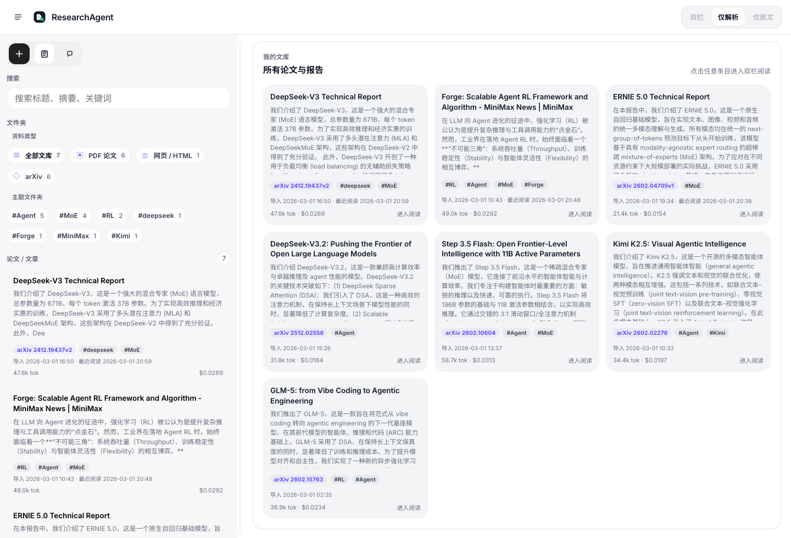
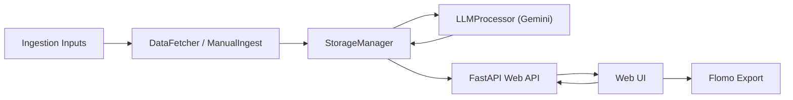

# ResearchAgent

ResearchAgent is a local-first RL / LLM infrastructure research workstation.



It is built for people who do not just want to "summarize a PDF", but want a durable workflow:

- collect papers and technical blogs
- filter for relevance
- generate structured Chinese deep dives
- compare analysis with the original source
- keep asking follow-up questions with persistent context
- export the best excerpts into a personal note system

## Core Product Value

ResearchAgent combines four previously separate tools into one system:

1. A source ingestion layer for arXiv papers, PDFs, GitHub releases, and dynamic technical blogs
2. A local storage model that keeps raw files and generated knowledge together
3. A Gemini-powered reading and chat layer with context reuse and cost visibility
4. A browser UI optimized for knowledge retrieval, reading, and iterative understanding

## Feature Set

### Ingestion

- Auto-fetch from arXiv, GitHub releases, and web sources
- Manual import for:
  - arXiv links
  - PDF uploads
  - arbitrary URLs
- Title-based arXiv suggestion search before import
- Browser-rendered web capture for dynamic pages

### Reading

- Gemini File API for PDF-first analysis
- Rich Markdown rendering with code blocks and LaTeX
- Dual-pane analysis vs source PDF reading
- Page reference links into the original PDF
- arXiv LaTeX asset extraction for figure galleries

### Knowledge Base

- Local archive by date
- Tag-driven foldering and manual tag editing
- Recent-read ordering
- Per-item import time and last-read time
- Token and cost accounting

### Chat

- Persistent multi-turn chat per article
- Context reuse via Gemini cache / uploaded files
- Explicit "prepare context" vs "generate answer" states
- Session history switcher
- Markdown-rendered responses
- Stop / abort support for in-flight requests

### Export

- Flomo excerpt export with preview editing
- automatic `#arxiv/...` tagging for arXiv content
- tag carryover from article metadata

## Architecture



Detailed module notes are in [docs/architecture.md](docs/architecture.md).

## Repository Structure

```text
.
├── .env.example
├── README.md
├── main.py
├── requirements.txt
├── prompts/
│   └── gemini_system_prompt.txt
├── data/
├── docs/
│   ├── architecture.md
│   ├── development.md
│   └── scholaread-benchmark-roadmap.md
├── research_agent/
│   ├── config.py
│   ├── models.py
│   ├── services/
│   └── web/
└── tests/
```

## Environment Setup

### 1. Create the isolated environment

```bash
python3.11 -m venv venv
source venv/bin/activate
pip install -r requirements.txt
playwright install chromium
```

You can also use:

```bash
bash scripts/create_venv.sh
```

### 2. Configure secrets locally

Do not hardcode keys into source control.

Create a local `.env` from `.env.example`, or export variables directly:

```bash
export GEMINI_API_KEY="..."
export GITHUB_TOKEN="..."
export FLOMO_WEBHOOK_URL="..."
```

## Running the System

### Run the pipeline once

```bash
venv/bin/python main.py run --limit 5
```

### Start the local web application

```bash
venv/bin/python main.py serve
```

Open [http://127.0.0.1:8000](http://127.0.0.1:8000).

### Run the scheduler

```bash
venv/bin/python main.py schedule --run-immediately
```

## Data Layout

Each imported source is archived under a date folder:

```text
data/2026-03-01/manual-arxiv-glm-5-from-vibe-coding-to-agentic-engineering/
├── article.md
├── metadata.json
├── source.pdf
└── source.html
```

This layout keeps retrieval simple:

- `metadata.json` for indexing and UI display
- `article.md` for generated knowledge
- source files for auditability and reprocessing

## Token and Cost Tracking

ResearchAgent records:

- prompt tokens
- output tokens
- total tokens
- per-turn estimated cost
- per-article estimated cost

The system also tracks chat session costs in the UI. Cost estimation is based on Gemini pricing assumptions embedded in the app and surfaced in metadata for inspection.

## Design Principles

- Local-first persistence over ephemeral chats
- Clear audit trail from generated insight back to raw source
- Comparison reading instead of single-pane summarization
- Product decisions that prioritize reading space over decorative UI
- Minimal secret exposure: environment variables only, no committed credentials

## Development and Testing

```bash
python3.11 -m py_compile research_agent/services/*.py research_agent/web/api.py
node --check research_agent/web/static/app.js
venv/bin/python -m pytest tests
```

See [docs/development.md](docs/development.md) for a fuller contributor workflow.

Repository-level contribution rules are in [CONTRIBUTING.md](CONTRIBUTING.md), and the project is released under the [MIT License](LICENSE).

## Current Scope (v0.1)

`v0.1` is intentionally product-complete rather than feature-complete. It focuses on a coherent reading workflow:

- import
- analyze
- compare with source
- chat
- save insights

Future work is documented in [docs/scholaread-benchmark-roadmap.md](docs/scholaread-benchmark-roadmap.md).
